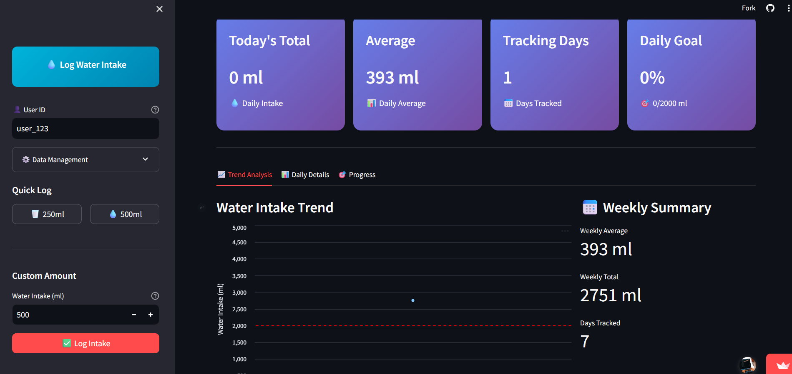
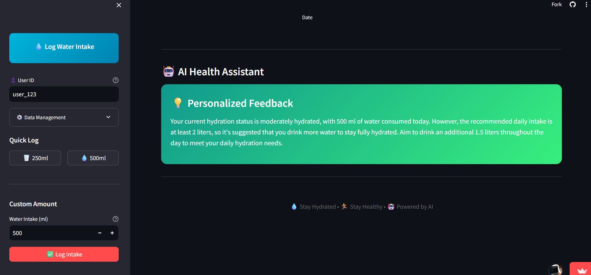

@"
# 💧 AI Water Tracker

A smart water intake tracking application with AI-powered feedback and beautiful visualizations.

https://water-tracker-pteriu8ekhpuxvovcamfgc.streamlit.app/  to start your Water Tracking journey

## Features

- 📊 **Smart Tracking**: Log and monitor your daily water intake
- 🤖 **AI Assistant**: Get personalized hydration feedback
- 📈 **Visual Analytics**: Interactive charts and progress tracking
- 💾 **Local Storage**: SQLite database for data persistence
- 🎨 **Beautiful UI**: Streamlit-powered modern dashboard

## Installation

1. Clone the repository:
\`\`\`bash
git clone https://github.com/yourusername/water-tracker.git
cd water-tracker
\`\`\`

2. Install dependencies:
\`\`\`bash
pip install -r requirements.txt
\`\`\`

3. Run the application:
\`\`\`bash
streamlit run dashboard/app.py
\`\`\`

## Usage

1. Start the application
2. Enter your user ID
3. Log your water intake using quick buttons or custom amounts
4. View your progress and get AI feedback
5. Monitor your hydration trends over time
"@ | Out-File -FilePath README.md -Encoding utf8

THE WORKING

